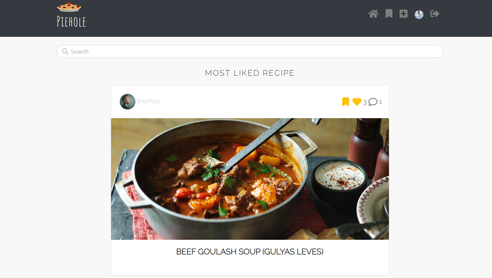

# Piehole

This is a recipe sharing website. Users can search and find recipes they want. They can create a profile and add their recipes, like and save others', and comment under posts.

The deployed link can be found [here](https://piehole-react.herokuapp.com/)

The link to the backend is [here](https://github.com/Emese92/Piehole-drf)

(To open links in a new tab, hold 'Ctrl' (or '⌘' on Apple devices) as you click!)

## User Experience (UX)

## User Stories

[User Stories](https://github.com/users/Emese92/projects/6)

## Features

- Easily understandable, clear, and quick to use
- Have access to the navbar from every page
- Can see the recipes in an infinite scroll
- Can search on recipe title, profile name, or ingredient
- Be able to create a profile, edit it and add a picture if wanted
- Be able to create, read, update, and delete recipes and comments they own
- Can like or unlike other's posts
- Can see how many likes and comments are on a post
- Be able to see the most liked recipe on top of the main and saved pages
- Users can save posts that they can reach on the bookmarks page or remove them from there
- The profile page shows all the posts the profile owner has made

### Navbar:

Accessible from every page. It has a responsive logo that takes the user back to the main page. On the left-hand side has a home, sign in and sign up, button or access to bookmarked posts, Add a new recipe, Profile page, or sign out logo according to authentication. The logos are clear to understand but they also have a descriptive message if hovered over. It has a collapsible navbar on smaller screens.

### Main page:

The main page is accessible to everyone. Users can see recipes, starting with the most popular one on the top and by created date under that. The main page has an infinite scroll so users don't need to click anywhere to get to the next page. It also has a search bar, users can search for ingredients, titles, or usernames. The recipes are card elements that have a big picture, on the bottom is the title of the recipe and on top is the user who created it, which takes the user to the creator's profile page, the save and like options, and the comments link that takes the user to the comments section. likes and comments also have a counter next to them.

### Profile Page:

It has a container with the profile owner's picture, name, and the number of posts. Under that, the user can find all the posts the profile user has posted.
If the user is the profile owner, then it has also access to the three dots when clicked. There is a possibility to add a picture, change the username, or change the password.

### Recipe page:

The recipe page is a nice card element with The recipe owner's name and avatar, the save and like options, and the comments counter.
It includes a full-width picture, the time to make it, the serving size, the ingredients, and the steps to make it. Right under the card the user can leave a comment and read what others commented. The comments also have the user's avatars and, name and how long ago the comment was created. The comment owner can edit and delete their comments.

### Login, Sign Up:

They are both similar-looking dark and orange containers with the possibility of creating an account or logging in.

### Bookmarks:

On the bookmarks page, the user still sees the most popular recipe on the website, and under there is the list of items the user has bookmarked before in the same fashion as the main page. This also has an infinite scroll and a search bar.

#### Add, Edit, Delete Recipes

Add a recipe page has a form to fill in when clicking on the navbar icon. The Edit a recipe page comes with a similar form just prefilled with the previous data. When deleting a recipe users go back to the main page. The edit and delete options are located in the three dots in the Recipe detail view.

### Design / Colour Scheme

There is a bootstrap dark gray navbar on the top of the pages, a light gray background, and a white container on most of the pages. The sign-in and sign-up containers are also dark gray. All pages have some orange highlights popping up.

#### Typography

[Google Fonts](https://fonts.google.com/)

Raleway with the fallback of sans-serif on the majority of the page, and Amatic SC with the fallback of cursive under the Logo.

#### Imagery

The icons I used are from [Font Awesome](https://fontawesome.com/).
Pictures are from [Pexels](https://www.pexels.com/sv-se/), [Clipart Library](http://clipart-library.com/search1/?q=pie#gsc.tab=1&gsc.q=pie&gsc.page=4.) and [BBC Food](https://www.bbc.co.uk/food)
The standard profile picture is from the Code Institute.

## Technologies

### Languages

- CSS3
- HTML5
- JavaScript

### Libraries and Frameworks

- React Bootstrap 4.6.0 
- Axios

### Websites & Programs Used

- [msw](https://mswjs.io/)
- [Font Awesome](https://fontawesome.com/)
- [Google Fonts](https://fonts.google.com/)
- [Gitpod](https://gitpod.io/projects)
- [heroku](https://dashboard.heroku.com/apps)
- Paint

## Testing

### Automated tests:

 The Navbar has been tested with [Mock Service Worker](https://mswjs.io/):
 - It is checking if a user can see a sign-in button
 - If an authenticated user can see profile, bookmarks, add a new recipe, and logout buttons
 - If after logging out the user can see the sign-in and sign-out buttons

 All test passed

### Manual tests:

- Validation error messages appear correctly in the right place
- Times are in the correct format
- Helper text is visible and understandable
- Field labels are correct
- Checked the functionality of buttons available on all pages.
- Checked the functionality of links available on all pages.
- Checked the text on all pages for spelling and grammatical errors
- The user is not able to submit a page twice by pressing the submit button quickly.
- Validated all web pages (validate HTML and CSS for syntax errors)
- Tested the search bar returning correct data on entering the correct value
- Save button saves correctly the posts
- Checked all CRUD possibilities and working fine

### Database tests:

* data reflecting at front-end and stored at the back end is correctly synchronized and updated
* data or values, fetched from the front end are being correctly and successfully getting stored at the back end.

### Performance

There are no console errors present other than 401 unauthorized when not signed in.
I have tested the website on multiple devices (phone, laptop, and desktop).

### Validator testing

-[CSS Validator](https://jigsaw.w3.org/css-validator/validator?uri=https%3A%2F%2Fpiehole-react.herokuapp.com%2F&profile=css3svg&usermedium=all&warning=1&vextwarning=&lang=sv)-Passed

-[HTML Validator](https://validator.w3.org/nu/?doc=https%3A%2F%2Fpiehole-react.herokuapp.com%2F)-Passed

### ESLint

Errors:
-Props Validation
-Passing of children as props
-Missing React when using JSX

I didn't address these due to lack of time

### Lighthouse Test

### Bugs

- After deployment, I realized a bug when an unauthorized user wanted to see a recipe it throw an error. - It has been fixed by adding an extra line of -let isOwner- to the comments.js file.

- I had some misspelling issues - they all should be fixed now.

- The ProfileEditForm.js page was originally together with the UsernameForm.js, it worked with some issues with the username needing to be changed to submit it correctly - Tutor support suggested that I separate them so now they work fine.

- EsLint caused errors that dind't let me deploy my project - I had to delete EsLint and reinstall package.json

## Deployment

This project was deployed using Code Institute's mock terminal for Heroku.

- Steps for deployment:
  - Login on the Heroku website
  - Click on New, then Create a new app
  - In Settings, set the Config Vars
  - In the Deploy tab connect your GitHub
  - Scroll to Manual deploy and click on Deploy Branch

### Forking

- If you wish to fork the repository:
  - GitHub Search my username and repository
  - Select the repository
  - Click the fork icon in the top right
  - This creates a fork within your GitHub repositories
  - Edit the files as necessary to your remote repository

## Credits
- The moments walkthrough project from the Code Institute
- [BBC Food](https://www.bbc.co.uk/food) for the recipes and pictures
- https://mdbootstrap.com/
- https://stackoverflow.com/questions/16156594/how-to-change-border-color-of-textarea-on-focus
- https://stackoverflow.com/questions/8627902/how-to-add-a-new-line-in-textarea-element
- https://developer.mozilla.org/en-US/docs/Web/CSS/object-fit
- Thank you for my mentor and Tutor assistance in reviewing and helping with the code.
